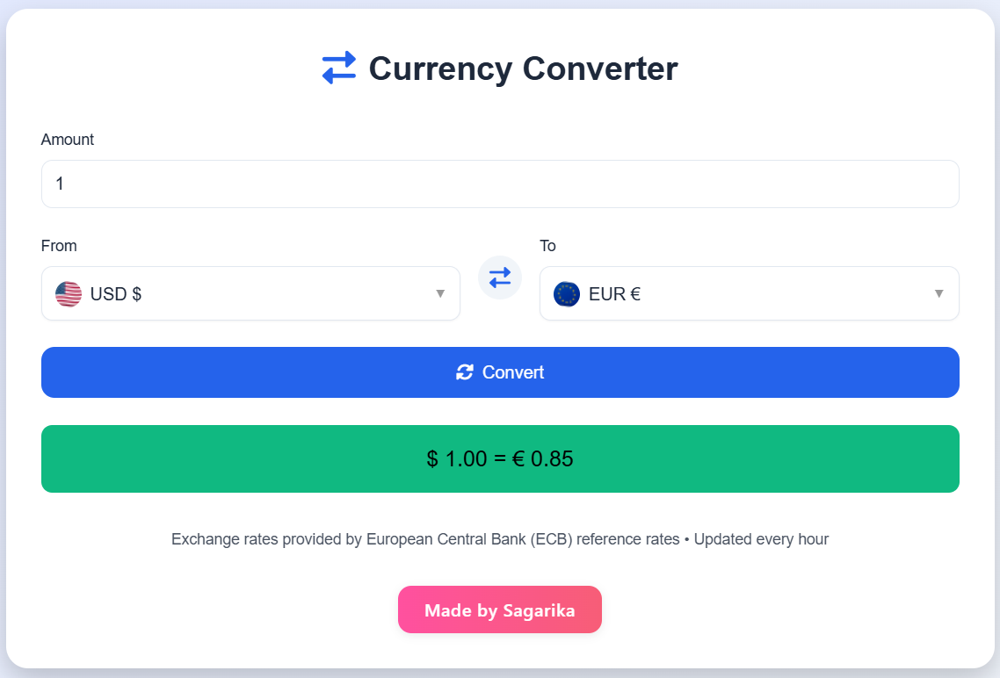

# Currency Converter 💱


A sleek and responsive **Currency Converter** web application built with **Node.js** and **Express**, leveraging real-time exchange rates from the **European Central Bank (ECB)**. Easily convert between multiple currencies with country flags, symbols, and a smooth, interactive UI.

---

## 🌟 Features

* ✅ Real-time currency conversion using ECB exchange rates
* ✅ Over 40+ global currencies supported
* ✅ Currency flags & symbols for easy identification
* ✅ Swap currencies with a single click
* ✅ Interactive and responsive custom select dropdowns
* ✅ Input validation with error handling
* ✅ Cached rates to minimize API calls and improve performance
* ✅ Mobile-friendly layout with smooth animations

---

## 📦 Technologies Used

* **Backend:** Node.js, Express, XML2JS
* **Frontend:** HTML, CSS, JavaScript
* **API:** European Central Bank (ECB) reference rates
* **Deployment:** Render / Railway

---

## 🖼 Screenshots

<div align="center">

**Conversion Result Display**



</div>


## 🚀 Live Demo

Check it out live: [Currency Converter on Render](https://currency-converter-h6r6.onrender.com/)

---

## 💻 Getting Started

### Prerequisites

* Node.js v18+
* npm

### Installation

1. Clone the repository:

```bash
git clone https://github.com/Sagarika311/currency-converter.git
```

2. Navigate to the project folder:

```bash
cd currency-converter
```

3. Install dependencies:

```bash
npm install
```

4. Start the server:

```bash
node server.js
```

5. Open your browser at `http://localhost:3000`

---

### Usage

1. Enter an **amount** to convert.
2. Select the **source currency** (From) and **target currency** (To).
3. Click **Convert** to see the converted value.
4. Use the **swap button** to quickly switch between currencies.

---

## 🔧 Folder Structure

```
currency-converter/
│
├─ public/
│  ├─ index.html       # Frontend HTML
│  ├─ styles.css       # CSS styles
│  └─ script.js        # Frontend JS
│
├─ server.js           # Express server & API
├─ package.json
├─ package-lock.json
├─ README.md
└─ screenshots/        # Add screenshots here
```

---

## 🛠 Customization

* Add/remove currencies by editing `currencyFlags` and `currencySymbols` in `script.js`.
* Change theme colors in `styles.css` using CSS variables.

---

## 📄 License

This project is licensed under the **ISC License** – see the [LICENSE](LICENSE) file for details.

---
